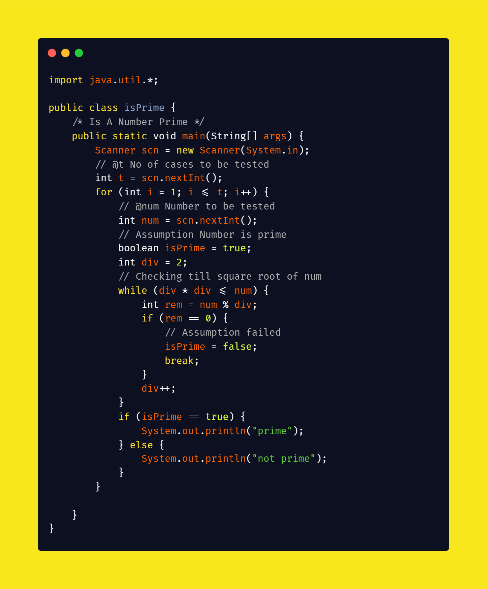
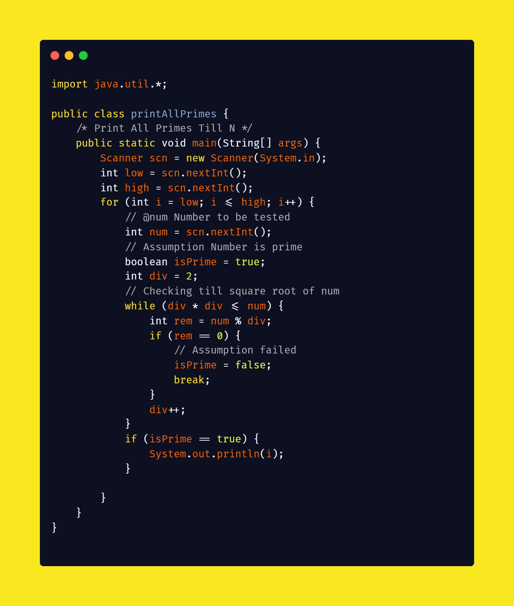

## Lecture 3 Solutions

### Is A Number Prime

#### [isPrime Source Code](solutions/isPrime.java)

### Print All Primes Till N

#### [printAllPrimes Source Code](solutions/printAllPrimes.java)

### Print Fibonacci Numbers Till N

#### [printFibonacci Source Code](solutions/printFibonacci.java)
