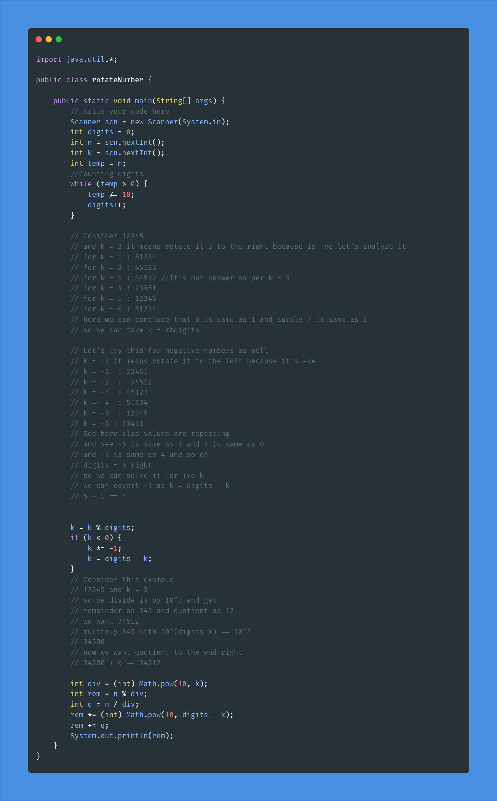

## Lecture 4 Solutions

### Count Digits In A Number

Time Complexity O(n)

#### [countDigits Source Code](solutions/countDigits.java)

### Digits Of A Number

Time Complexity O(n)

#### [printDigits Source Code](solutions/printDigits.java)

### Reverse A Number

Time Complexity O(n)

#### [printReverse Source Code](solutions/printReverse.java)

### Inverse Of A Number

Time Complexity O(n)

#### [inverseNumber Source Code](solutions/inverseNumber.java)

### Rotate A Number

Time Complexity O(n)

#### [rotateNumber Source Code](solutions/rotateNumber.java)
