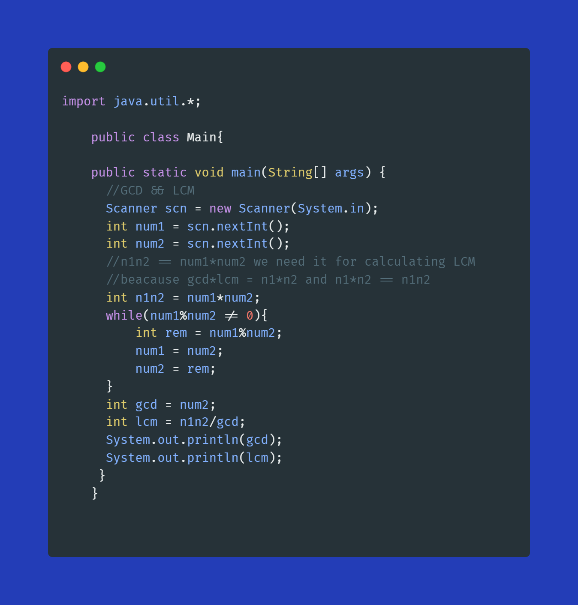
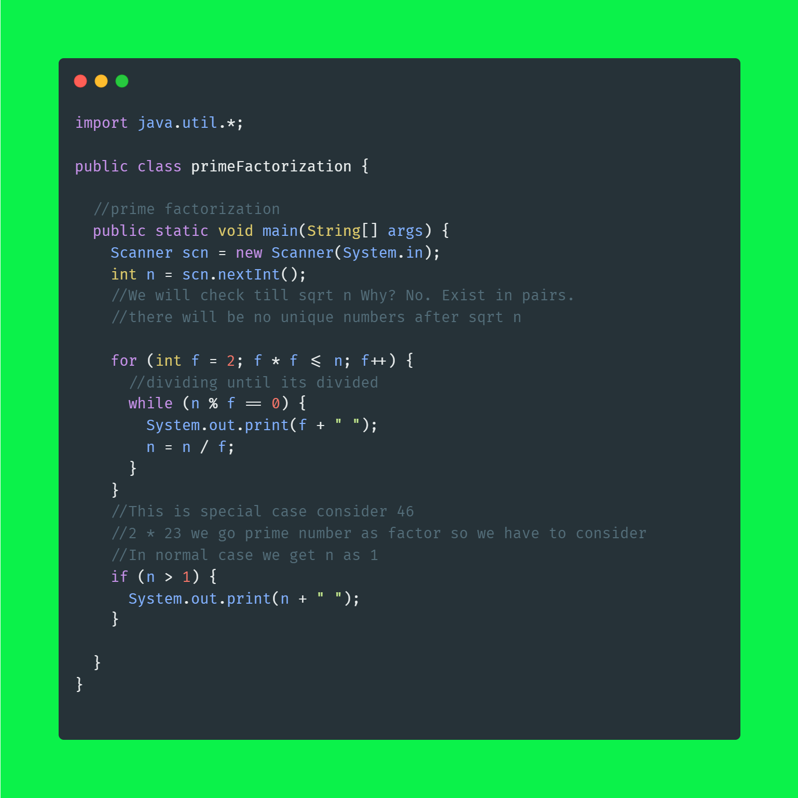
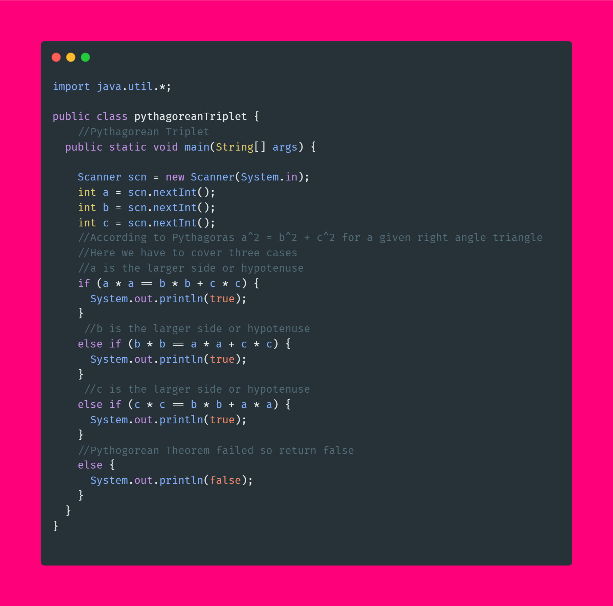
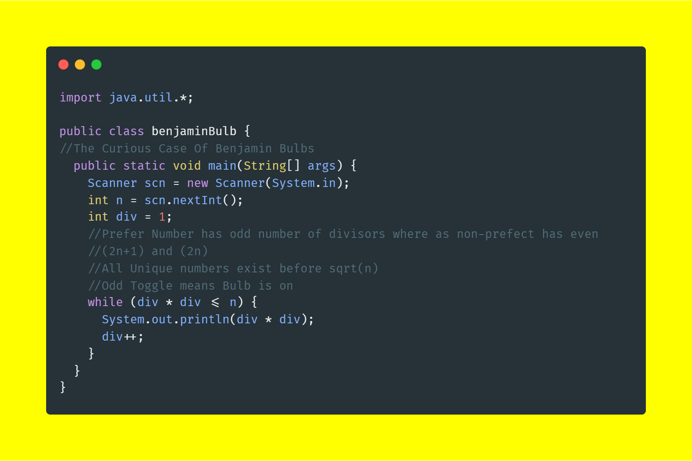
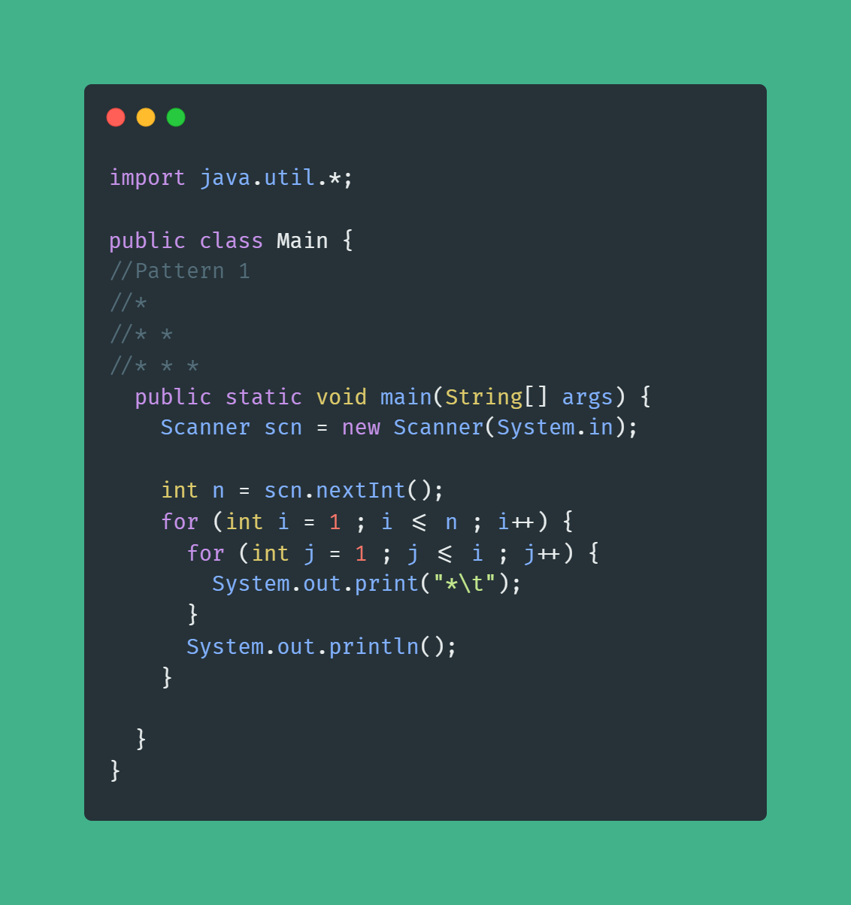
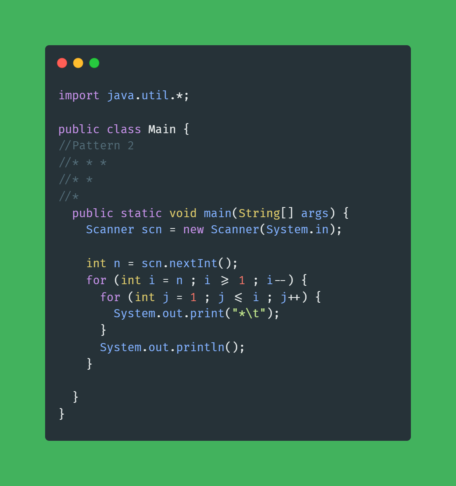

## Lecture 5 Solutions

### GCD and LCM

Time Complexity O(log(min(a,b))) where a is the first number and b is the second number

#### What?
**We are follwing the prime factorization that we had done in our school.**

#### How?
#### [gcdLCM Source Code](solutions/gcdLCM.java)

#### Why?
**Remember 3%2 gives 1 and 2%3 gives 2 and while executing we are swapping values, that's why it's work**

### Prime Factorization

Time Complexity O(sqrt(n))

#### What?
**We have done this in our school divide the number until it's dividig by current number until we get 1**

#### How?
#### [primeFactorization Source Code](solutions/primeFactorization.java)

#### Why?
**The number exist in pairs there will no unique factors after sqrt(n)**

<em> Special Case : When n is not 1 after diving until sqrt(n), then it's prime number, simply print it.</em>

### Pythagoren Triplet

Time Complexity O(1)

#### What?

**Pythagoras theorem says that sum of square of smaller sides is equal to sum of larger sides i.e a^2 = b^2 + c^2**

#### How?
#### [pythagoreanTriplet Source Code](solutions/pythagoreanTriplet.java)

#### Why?
**There are only 3 cases when a is larger or b is larger or c is larger**

### The Curious Case Of Benjamin Bulbs

Time Complexity O(sqrt(n))

#### What?
**We will check perfect squares only**

#### How?
#### [benjaminBulb Source Code](solutions/benjaminBulb.java)

#### Why?
**Perfect Squares have odd number of factors which is 2n+1 whereas non-perfect squares have 2n or even factors**
**They are touched odd times, so they are in on state**

### Pattern 1

Time Complexity O(n*n)

#### [pattern1 Source Code](solutions/pattern1.java)

### Pattern 2

Time Complexity O(n*n)

#### [pattern1 Source Code](solutions/pattern2.java)

